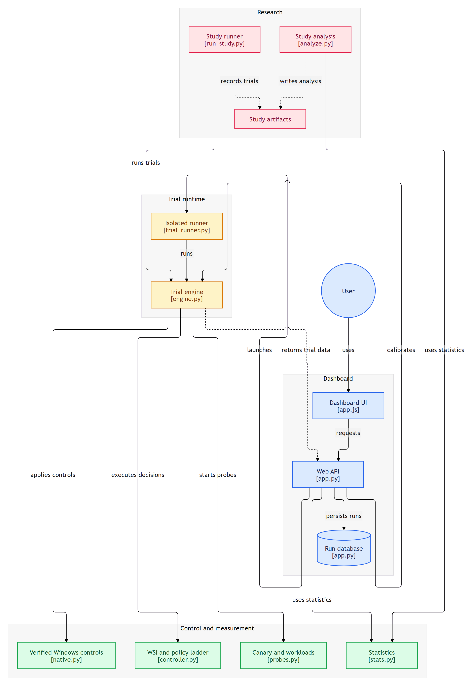

# SmartSwap

**Measuring and mitigating background interference on unmodified Windows desktops with a user-mode stall index.**

Background work (sync clients, indexers, updates, builds) slows down the app you are using, but Windows only tells software how *busy* the machine is, not how much time interactive work is *losing*. SmartSwap:

1. **Measures** that loss with the **Windows Stall Index (WSI)**: a low-duty canary process wakes every 40 ms and times its own scheduling delay, compute, memory streaming, and unbuffered disk reads. This is a PSI-style signal that needs no admin rights, drivers, or hardware counters.
2. **Names the cause** (CPU, memory bandwidth, or storage) by testing the most *specific* symptom first.
3. **Applies the cheapest fix that works**, using a ladder: lower background priority → steer background work to efficiency cores (hybrid CPUs) → an AIMD-tuned Job Object CPU-rate cap.
4. **Proves every action twice**: Windows reads back that it took effect, and the canary confirms it helped. Otherwise it is rolled back.

It only ever acts on background processes SmartSwap itself started, never raises a priority, and reverts every change.

## Results (one hybrid-core laptop, 460 randomised trials, 0 failures)

| Claim | Evidence |
|---|---|
| WSI tracks what the user feels | Spearman ρ = **0.96** between canary WSI and a *separate* app's p95 latency (50 observe-only trials) |
| WSI detects interference | ROC AUC **0.965–1.000**; **1.2%** false alarms on a quiet PC |
| The cause is named correctly | **92.4% / 85.8% / 99.6%** of stalled periods for CPU / memory bandwidth / storage |
| Tail latency is cut | p95 reduced by **87–94%** under CPU and mixed contention |
| E-core steering helps on hybrid CPUs | Memory-bandwidth contention: **0.73×** the p95 of the best static policy (95% CI 0.67–0.75, 8/8 blocks) |
| The ladder matters | Without it, p95 is **4.8×** worse (CPU) and **3.8×** worse (mixed) |
| Every action is real | **1,575 / 1,575** actions and **322 / 322** reverts verified by kernel read-back |

What we report honestly: plain static priority demotion is a strong baseline and ties SmartSwap on CPU and mixed contention. Without steering, v2 over-throttles under memory contention. All results come from one machine, with synthetic foreground and background workloads. With 8–10 blocks, effects are large and consistent, but no comparison survives a family-wide Holm correction.

## System design



## Run it

Requires Windows 10/11 and Python 3.12+. No administrator rights are needed.

```powershell
python -m pip install -r requirements.txt
.\scripts\start.ps1            # serves http://127.0.0.1:8765
```

The dashboard has four pages:
- **Monitor:** live CPU and memory, the busiest processes, and the live stall index with its likely cause.
- **Experiment:** run a trial and see its controller timeline and verified action ledger, or run a paired comparison.
- **Evidence:** the study results.
- **Reports:** exports, a capability scan, and an emergency stop.

`.\scripts\run-safe-demo.ps1` runs one bounded demo trial.

## Reproduce the study

```powershell
python -m research.run_study --blocks 10                          # main study (~2 h; keep the PC otherwise idle)
python -m research.run_study --design hybrid --blocks 8           # E-core steering study
python -m research.run_study --design slo-sweep --blocks 6        # protection-vs-cost frontier
python -m research.analyze "$env:LOCALAPPDATA\SmartSwap\results\<study-id>"
```

Studies use a randomised complete block design. Analysis uses paired exact Wilcoxon tests, 95% bootstrap CIs, and Holm correction. Results, figures, and LaTeX tables are written next to each study's raw per-beat traces.

## Layout

```
backend/     probes.py (canary, foreground probe, workloads) · controller.py (WSI, attribution, ladder)
             native.py (verified Win32/NT controls) · engine.py (one trial) · app.py (API) · trial_runner.py
frontend/    dependency-free dashboard
research/    run_study.py (study harness) · analyze.py (statistics and figures)
tests/       pytest suite (controller logic, statistics, API)
docs/        AUDIT_V1.md - why the v1 results were invalid
```
